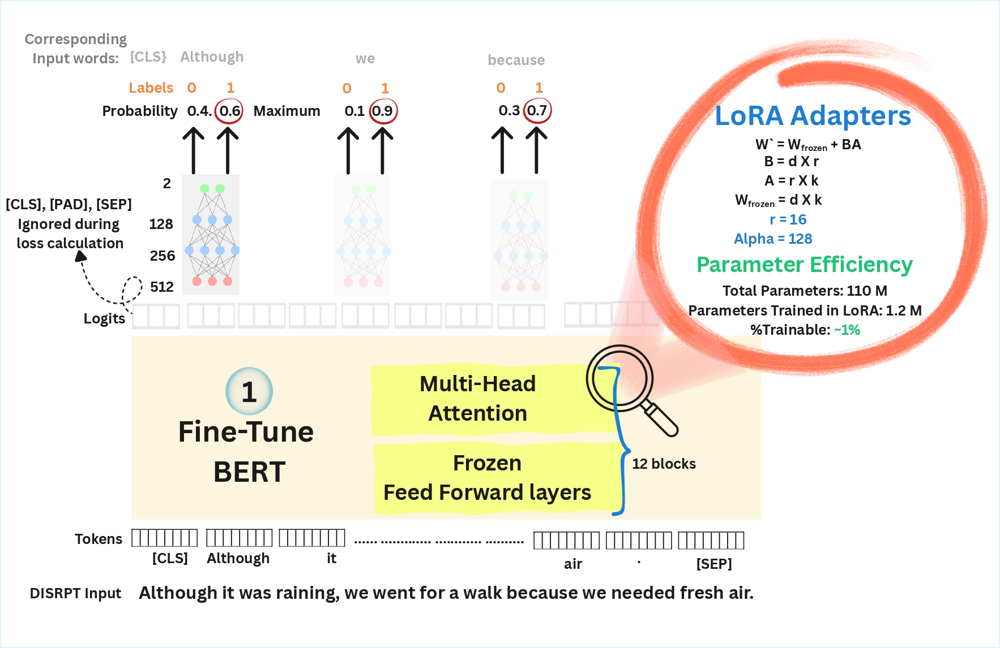

# 🧠 EDU Segmenter – BERT Fine-Tuning with LoRA

This repository provides code for **fine-tuning transformer models (like BERT/DistilBERT)** for **EDU segmentation** tasks, 
with support for **LoRA parameter-efficient training**, **early stopping**, and **Weights & Biases (W&B)** experiment tracking.

---

## 📋 Prerequisites

Before you begin, ensure you have the following installed:

- **Python 3.10+**
- **Git**
- **pip** (Python package manager)

Optional but recommended:
- **GPU with CUDA** for faster training
- A [Weights & Biases (W&B)](https://wandb.ai/site) account for run tracking
- [`uv`](https://github.com/astral-sh/uv) is a fast Python package and environment manager.
    ```bash
  
    pip install uv
    ````
---

## ⚙️ Steps to Follow

### 1. Download/Clone the repository

```bash 

git clone [https://github.com/vighneshk05/EDU-Segmenter.git]
```


### 2. Create and activate a new environment

```bash

uv venv .venv
source .venv/bin/activate   # macOS / Linux
```

#### OR
```bash

.venv\Scripts\activate      # Windows
````

#### Optional
Set this parameter to ignore the tokenizer warning
```bash
export TOKENIZERS_PARALLELISM="true"
````

### 3. Install the Project Dependencies
Make sure you run these commands from from folder with pyproject.toml file
```bash

uv pip install -e .
````

### 4. Dataset download and verification
To download and validate the datasets, simply run:
```bash
python -m com.disrpt.segmenter.dataset_prep
```
This will:
- Download all defined corpora into the dataset/ directory.
- Load each dataset (train.conllu, dev.conllu, test.conllu) automatically.
- Display detailed statistics for EDU segmentation (tokens, EDU counts, and balance).
- Confirm token and label shapes match.

### 5. Fine-tune the model

There are 2 segmenters defined which use a transformer model (DistilBERT or BERT) with LoRA applied to the self-attention mechanism. The fundamental difference lies in the classification head used to predict the EDU boundaries.

1. **Segmenter_tuning.py**: Standard Linear Head (Hugging Face default for `AutoModelForTokenClassification`)
2. **fine_tuning.py**: Custom Multi-Layer Perceptron (MLP) Head


#### **Model Architecture Comparison**



| Feature | fine_tune_with_linear_head.py | fine_tune_with_mlp.py |
|---------|-------------------------------|----------------|
| Base Model | DistilBERT/BERT               | DistilBERT/BERT |
| LoRA Adaptation | ✓ (query, value)              | ✓ (query, value) |
| Classification Head | Single Linear Layer           | Multi-Layer Perceptron |
| Head Architecture | `[768 → 2]`                   | `[768 → 256 → 128 → 2]` |
| Dropout | None                          | 0.3 (configurable) |
| Activation | None                          | GELU (configurable) |

---
#### **Running the Fine-tuning Scripts**

##### **Option 1: fine_tune_with_linear_head.py**

**Basic usage:**
```bash
python -m com.disrpt.segmenter.fine_tune_with_linear_head
```

**With custom parameters:**
```bash
python -m com.disrpt.segmenter.fine_tune_with_linear_head \
  --model_name distilbert-base-uncased \
  --output_dir ./output/edu_segmenter \
  --epochs 10 \
  --batch_size 16 \
  --learning_rate 3e-4 \
  --save_every_n_epochs 2 \
  --early_stopping_patience 3 \
  --use_wandb \
  --wandb_project edu-segmentation \
  --wandb_run_name distilbert-linear-head
```

**Default Parameters:**
- `--model_name`: `distilbert-base-uncased`
- `--output_dir`: `./output/edu_segmenter`
- `--epochs`: `10`
- `--batch_size`: `16`
- `--learning_rate`: `3e-4`
- `--save_every_n_epochs`: `2`
- `--early_stopping_patience`: `3`
- `--use_wandb`: `False` (flag to enable)
- `--wandb_project`: `edu-segmentation`
- `--wandb_run_name`: Auto-generated (model name + lr + epochs)

**LoRA Configuration (fixed):**
- LoRA rank (`r`): `16`
- LoRA alpha: `32`
- LoRA dropout: `0.1`
- Target modules: `["q_lin", "v_lin"]` (DistilBERT) or `["query", "value"]` (BERT)

---

##### **Option 2: fine_tune_with_mlp.py**

**Basic usage:**
```bash
 python -m com.disrpt.segmenter.fine_tune_with_mlp
 ```

**With custom parameters:**
```bash
python -m com.disrpt.segmenter.fine_tune_with_mlp \
  --model_name distilbert-base-uncased \
  --output_dir ./output-2/edu_segmenter \
  --epochs 10 \
  --batch_size 16 \
  --learning_rate 3e-4 \
  --mlp_dims 256 128 \
  --mlp_dropout 0.3 \
  --lora_r 16 \
  --lora_alpha 32 \
  --lora_dropout 0.1 \
  --save_every_n_epochs 2 \
  --early_stopping_patience 3 \
  --use_wandb \
  --wandb_project edu-segmentation \
  --wandb_run_name distilbert-mlp-head
```

**Default Parameters:**
- `--model_name`: `distilbert-base-uncased`
- `--output_dir`: `./output-2/edu_segmenter`
- `--epochs`: `10`
- `--batch_size`: `16`
- `--learning_rate`: `3e-4`
- `--save_every_n_epochs`: `2`
- `--early_stopping_patience`: `3`
- `--use_wandb`: `False` (flag to enable)
- `--wandb_project`: `edu-segmentation`
- `--wandb_run_name`: Auto-generated

**MLP Configuration:**
- `--mlp_dims`: `[256, 128]` (hidden layer dimensions)
- `--mlp_dropout`: `0.3`
- MLP activation: `GELU` (fixed)

**LoRA Configuration:**
- `--lora_r`: `16` (LoRA rank)
- `--lora_alpha`: `32`
- `--lora_dropout`: `0.1`
- Target modules: `["q_lin", "v_lin"]` (DistilBERT) or `["query", "value"]` (BERT)

---

#### **Available Model Options**

Both scripts support any HuggingFace BERT-based model:
- `distilbert-base-uncased` (default, faster)
- `bert-base-uncased`
- `bert-base-cased`
- `roberta-base`
- Any compatible model from HuggingFace Hub

---

#### **Weights & Biases (W&B) Integration**

Both scripts support optional W&B logging for experiment tracking:
```bash
#Set W&B API key
export WANDB_API_KEY="your_wandb_api_key_here"

# Enable W&B logging
python fine_tune_with_linear_head.py --use_wandb

# Custom W&B project and run name
python fine_tuning.py \
  --use_wandb \
  --wandb_project my-edu-project \
  --wandb_run_name experiment-001
```

**W&B logs include:**
- Training/validation metrics (accuracy, precision, recall, F1)
- Per-class metrics (for both EDU Continue and EDU Start)
- Loss curves
- Learning rate schedules
- Model architecture
- Confusion matrix
- Final results table
- Model artifacts (best checkpoint)

---

#### **Output Structure**

After training, the output directory will contain:
```
output/edu_segmenter/
├── best_model/              # Best model checkpoint
│   ├── adapter_config.json
│   ├── adapter_model.bin
│   ├── config.json
│   ├── tokenizer_config.json
│   └── ...
├── logs/                    # TensorBoard logs
├── checkpoint-XXX/          # Periodic checkpoints
└── ...
```
